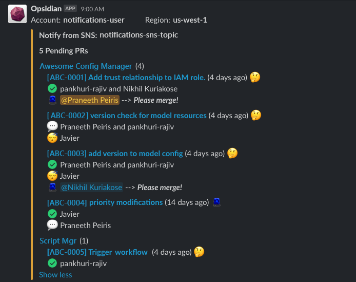

# Pull Request Reports
Send GitHub Pull Requests notifications to Slack, Email or anywhere.

## What does this code do?

This repository contains an independently runnable code which will retrieve open Pull Requests from a given set of 
GitHub repositories, and then sends a notification to the configured target such as Slack or Email.

  

## How to use?

This script is NOT a read-made solution. So you need to change several things before using this script. 


### Configs

The example config file is placed inside `configs` as `config.sample.json` and you should update the configs to match your requirements.

#### Config values

```json
{
  "organization": "my-org",
  "global_min_approvals": 2,
  "pr_duration_warnings": {
    "show_warnings": true,
    "warnings": [
      [2, "low"],
      [5, "medium"],
      [10, "high"],
      [14, "critical"]
    ]
  },
  "show_open_since": true,
  "show_open_pr_count": true,
  "max_names_limit": 2,
  "ignore_repos_with_zero_prs": true,
  "repositories": [
    {
      "repo": "my-repo",
      "min_approvals": 2
    },
    {
      "repo": "my-other-repo",
      "min_approvals": 2
    }
  ]
}
```

* `organization` (string)  
    Unique name (login name) of the organization you want to work with. i.e. https://github.com/<organization>/  
* `global_min_approvals` (int)  
    How many minimum number of approvals required for a PR to be able to merge. When a repository section doesn't have `min_approvals`
    defined, this value is used. This parameter is only used to notify the owner of the PR.
    
* `pr_duration_warnings`   
    * `show_warnings` (boolean)  
        Whether to show warning emojis when the PR is getting old.
    * `warnings`  
        List of pairs representing the stages of the PR warning according to the number of days since it was open.  
        i.e. `[2, "low"]` --> Any PR open for 2 days or less will be marked as `low`.   
        If it's more than 2 days, it will be caught by `[5, "medium"]` and will be marked as `medium` if it's open for 5 days or less.   
        You have the flexibility of adding more warning levels (with number of days), but make sure the label (second element) is unique.

* `show_open_since` (boolean)  
    Shows the number of days since the PR was open.  
    i.e. `Some random PR (4 days ago)`

* `show_open_pr_count` (boolean)  
    Whether to show the number of open PRs per repository (after the repository name).  
    i.e. `my awesome repo (3)`

* `max_names_limit` (int)  
    How many GitHub usernames should be shown before getting truncated.  
    i.e. If `max_names_limit` is set to 2:  
        - `Developer 1, Developer 2 and 3 others`  
        - `Developer 1 and Developer 2`

* `ignore_repos_with_zero_prs` (boolean)  
    If enabled, repositories with zero open PRs will not be added in the repo.  
    
* `repositories` (list)  
    * `repo` - Name of the repository
    * `min_approvals` - Minimum number of approvals needs before notifying the owner. This overrides `global_min_approvals`.

#### Where to host the configs.json?

For now, we can put the config file either in an S3 bucket or deploy along with the code.  
You can use `Config.load_from_s3(bucket_name, key)` or `Config.load_from_local(file_name)` functions to load the configs respectively.  

If you're using the local file, pass the config file path as`CONFIG_FILE` parameter.  
If you're using a config file from an S3 bucket, you can pass `BUCKET_NAME` and `CONFIG_FILE_S3_PATH` parameters.

Feel free to add your own ways of reading configs (i.e. a NoSQL table) and make a PR.

**Advice**: Use the local file only for testing to avoid having to re-deploy the code when you changed the config. 


### GitHub Token

You need to generate a Personal Access Token from the [Developer Settings](https://github.com/settings/tokens) in GitHub, and set `GITHUB_TOKEN` environment varibale, to enable this script to read the repositories. 

**Note**: Make sure you ***ONLY*** give read-only access to the generated token to avoid any accidental changes to the repositories (if you're to change the code).


### Message format

Currently it supports two main types of message formats.

1. Slack (for both SNS based and Incoming WebHook based)
2. HTML

#### Slack
`formatters.slack.RepoFormatter` and `formatters.slack.PRFormatter` classes will generate the message in the [Slack message format](https://api.slack.com/reference/surfaces/formatting).

#### HTML
`formatters.html.RepoFormatter` and `formatters.html.PRFormatter` classes will generate the message in basic HTML.

*TODO*: Add CSS to the HTML elements.

#### Custom formatters
If you need to add more formatting options, you can create sub-classes of `formatters.BaseRepoFormatter` and/or `formatters.BasePRFormatter` and re-implement any protected methods you wish.


```python
from formatters import NameFormatter
from formatters.html import RepoFormatter, PRFormatter
...
name_formatter = NameFormatter(config)
pull_formatter = PRFormatter(config, name_formatter)
repo_formatter = RepoFormatter(config, pull_formatter)
```

### Targets

You have the capability of pushing the generated message to several targets. Here are the currently available `targets`.

1. Amazon SNS (for both Slack and HTML)
2. HTTP Endpoint
3. Slack Incoming WebHook (sub-class of HTTP Endpoint)

You may add any targets as you wish, by simply implementing a `send(title, message)` method or any function you'd like.

## Where to deploy?

For the moment, there is only a scheduled AWS Lambda function defined in `cloudformation/daily_report.yaml`. 
You can however use this code in any environment such as Amazon EC2/ECS, GCP Functions, or even on your pc.

However, no CloudFormation templates are available (yet) for other environments and feel free to create a PR if you like.
The code is (almost) platform-independent, yet you need to `main.handler` function parameters accordingly.

If you want to use this as a scheduled Lambda function, you can check the deployment section.

## How to deploy?


### Setup a Python Virtual Env

```
cd path_to_project

python3 -m venv .venv
source .venv/bin/activate
pip install -r requirements.txt
```

### Test the code

You can test the code on your local machine by passing the relevant parameters at the runtime.  

`PYTHONPATH=./src/ CONFIG_FILE=configs/config.json python src/main.py`

These parameters will change depending on the sub-components you're using.

### Deploy

You can easily deploy this code as a AWS Lambda function with the given cloudformation file.  
However, you need to change some parameters in the `Makefile`.

* `BASE_STACK_NAME` - CloudFormation Stack prefix
* `BUCKET` - Bucket where the Lambda package will be uploaded and the config file is stored.
* `TEAM` - Team name to be added as tags (no important)

Then, you can deploy the stack using the below command.

`make release TARGET=daily_report`

You can pass `ENV` parameter as well.

`make release TARGET=daily_report ENV=production`


## Contribute

If you think of adding more features, you're more than welcome to create a PR and improve this code.
